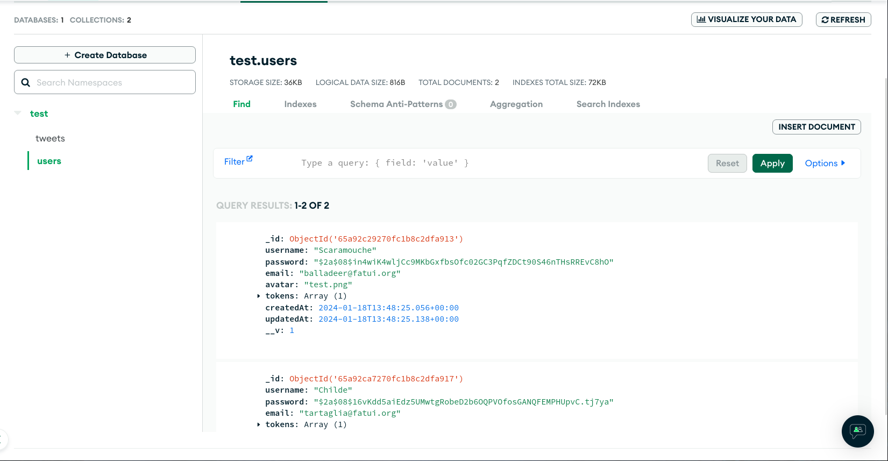

# X-API - Scaled down

## Primary Objectives

Build an X Clone (scaled down):

- API architecture: REST

- Models:

  - User: Required features - CRUD (!)
    - Username - UNIQUE
    - Email - UNIQUE
    - Password - HASHED
  - Tweet: Required features - CRUD (!)
    - Author - Foreign Key - Username
    - Content
    - TimeHMS stamp

- Behaviour:

  - Tweets should be editable by the users that made them
  - Every tweet should be viewable by everybody else
  - OAuth should be implemented (new)

---

## Details

- The packages are managed using corepack enabled `Yarn v4`. There are
  no `node_modules`, so LSPs are compromised for library definitions, but
  the pnp functionality makes the project lighter.
- The DB used is `MongoDB @ 7.0.3` with `Mongosh @ 2.0.2`.
  The DB names used during development are docker containers:
  - `x-api` @ `mongodb://0.0.0.0:27017/x-api`
  - `x-api-test` @ `mongodb://0.0.0.0:27017/x-api-test`

---

## Approach

### Initializing project

(i) Start by setting up your project with yarn

```bash
corepack enable
yarn init -2
```

(ii) Modify the `.gitignore` file to enable zero-installs by commenting out `.pnp`,
and then run the following command

```bash
yarn config set enableGlobalCache false
```

(iii) Add any linter and formatting configuration files. Create the `.env` file along
with the `src/` and `.github/` folders, and modify the package.json file with
optional fields.

```JSON
{
  "name": "...",
  "version": "...",
  "packageManager": "yarn@4.0.2",
  "description": "...",
  "author": "...",
  "private": "...",
  "license": "...",
  "type": "module",
  "scripts": {
    "start": "...",
    "serverDev": "...",
    "websiteDev": "...",
  },
  "dependencies": {
  }
}
```

(iv) Modify .gitattributes and any other dotfiles as necessary

### Setting up the database

As stated earlier, the project uses MongoDB in conjunction with MongoSH and mongoose.

For local development you may use a docker container for your DB if you are
unable to get the client on your local machine.

### Creating the API

(i) Create the following in your `src/` folder:

- `db/` (For the settings related to the database connection)
- `middleware/` (For the JWT token and password hashing verification middleware)
- `models/` (For storing the schemas of the user and tweet models)
- `routers/` (For storing the various routes supported by this API)
- `app.js` (Code that stores the app functionality)
- `index.js` (Start point for the server)

(ii) Set up the connection:

Ensure your monogo client is connected and running. Create the file `db/connection.js`,
and set the following

```javascript
// db/connection.js

import dotenv from "dotenv";
import mongoose from "mongoose";

dotenv.config();

const opts = {
  serverSelectionTimeoutMS: 30000,
};

mongoose.connect(process.env.MONGODB_URI, opts);

mongoose.connection.on("error", function (err) {
  console.error(`\x1b[31m\x1b[1mMongoDB connection error: ${err}\x1b[0m`);
});
```

Since this is the true startpoint for the code, we import and use `dotenv` here.

(iii) Now ensure your app enables the connection

```javascript
// app.js

import express from "express";

import "./db/connection.js";

const app = express();

app.use(express.json());

export default app;
```

and call this in your server:

```javascript
// index.js

import app from "./app.js";

const port = process.env.PORT || 3000;

app.listen(port, function (err) {
  if (err) console.error(err);
  console.log(`Server is up on port: ${port}`);
});
```

(iv) Next create the files `models/user.model.js` and `models/tweet.model.js`

The tweet model will be as defined here:

```javascript
// tweet.model.js

import mongoose from "mongoose";

const tweetSchema = new mongoose.Schema(
  {
    author: {
      type: mongoose.Schema.Types.ObjectId,
      required: true,
      ref: "User",
    },
    username: {
      type: String,
      required: true,
      ref: "User",
    },
    content: {
      type: String,
      trim: true,
      required: true,
    },
    pictures: [
      {
        type: String,
        trim: true,
        required: false,
      },
    ],
    videos: [
      {
        type: String,
        trim: true,
        required: false,
      },
    ],
  },
  { timestamps: true },
);

const Tweet = mongoose.model("Tweet", tweetSchema);
export default Tweet;
```

The user model will be as defined here:

```javascript
// models/user.model.js

import bcrypt from "bcryptjs";
import jwt from "jsonwebtoken";
import mongoose from "mongoose";
import validator from "validator";

const userSchema = new mongoose.Schema(
  {
    username: {
      type: String,
      required: true,
      trim: true,
      unique: true,
    },
    password: {
      type: String,
      required: true,
      trim: true,
      minLength: 8,
    },
    email: {
      type: String,
      required: true,
      trim: true,
      lowercase: true,
    },
    tokens: [
      {
        token: {
          type: String,
          required: true,
        },
      },
    ],
    avatar: {
      type: String,
      trim: true,
      required: false,
    },
  },
  { timestamps: true },
);
```

Furthermore, the file should also contain some business logic:

- Validation

```javascript
// Validation logic

// (1) Prevent password "password"
userSchema.path("password").validate(function (val) {
  return !val.toLowerCase().includes("password");
}, "Please use a stronger password");

// (2) Ensure a valid email address is entered
userSchema.path("email").validate(function (val) {
  return validator.isEmail(val);
}, "Email is invalid");
```

- Pre-event hooks

```javascript
// (1) Hash passwords before event "save"
userSchema.pre("save", async function (next) {
  if (this.isModified("password")) {
    this.password = await bcrypt.hash(this.password, 8); // Store hashed passwords in the DB on modification or new creation
  }
  next();
});

// (2) Cascade tweets before event "delete"
userSchema.pre("remove", async function (next) {
  await Tweet.deleteMany({ author: this._id });
  next();
});
```

- Virtuals

```javascript
// (1) Enable access to a user's tweets as if it is a property of the user
userSchema.virtual("tweets", {
  ref: "Tweet",
  localField: "_id",
  foreignField: "author",
});
```

- Document methods

```javascript
// Document specific methods

// (1) Generate an authentication token for a specific user
userSchema.methods.generateAuthToken = async function () {
  const token = jwt.sign({ _id: this._id.toString() }, process.env.JWT_SECRET);
  this.tokens = this.tokens.concat({ token }); // Store all tokens in an array to enable login on multiple devices
  await this.save();

  return token;
};

// (2) Ensure API response does not contain sensitive information
userSchema.methods.toJSON = function () {
  const userObject = this.toObject();

  // Delete the following sensitive fields
  delete userObject.password;
  delete userObject.tokens;
  delete userObject.avatar;

  return userObject;
};
```

- Model specific statics

```javascript
// Statics (Model specific)

// (1) Query the collection to find a user by their credentials, presumably entered by the client
userSchema.statics.findByCredentials = async function (username, password) {
  const user = await User.findOne({ username });

  if (!user) {
    throw new Error("Unable to login");
  }

  const isMatch = await bcrypt.compare(password, user.password);

  if (!isMatch) {
    throw new Error("Unable to login");
  }

  return user;
};
```

and finally, add an export statement at the bottom

```javascript
export const User = mongoose.model("User", userSchema);
```

(v) Create middleware for authorization.

Create a file `middleware/auth.js` that handles user authroization using JWT tokens

```javascript
// middleware/auth.js

import jwt from "jsonwebtoken";
import { User } from "../models/user.model.js";

const authMiddle = async function (req, res, next) {
  try {
    // Remove the `Bearer` from the Authorization header
    const token = req.header("Authorization").replace("Bearer ", "");
    const decoded = jwt.verify(token, process.env.JWT_SECRET);
    const user = await User.findOne({
      _id: decoded._id,
      "tokens.token": token,
    });

    if (!user) {
      throw new Error("User not found");
    }
    // Add a token and a user field to the request, to be used by the server
    req.token = token;
    req.user = user;
    next();
  } catch (e) {
    res.status(401).send({ error: "Authorization Failed" });
  }
};

export default authMiddle;
```

(vi) Create routers for the server. Start by making `routers/
user.router.js` and `routers/tweet.router.js`

First we work with the tweet routes. Import all the tweet model and the
authorization middleware, and initialise a new express router:

```javascript
// routers/tweet.router.js

import express from "express";
import authMiddle from "../middleware/auth.js";
import Tweet from "../models/tweet.model.js";

const tweetRouter = new express.Router();
```

Now in accordance with CRUD, define POST, GET, PATCH and DELETE operations

- POST

Under `{{url}}/tweets`, send a request body with the following content

```JSON
{
    "content": "...",
    "pictures": "...",
    "videos": "..."
}
```

ensure that an authorization header is sent with the appropriate Bearer token

```javascript
tweetRouter.post("/tweets", authMiddle, async function (req, res) {
  // Add an author  and username attribute to the request to complete the tweet schema requirements
  const tweet = new Tweet({
    ...req.body,
    author: req.user._id,
    username: req.user.username,
  });

  try {
    await tweet.save();
    res.status(201).send(tweet);
  } catch (e) {
    res.status(400).send({ error: "Malformed request" });
  }
});
```

- GET

Use the URL: `{{url}}/tweets?sortBy=parts[0]:parts[1]&limit={}&skip={}&username={}`

```javascript
tweetRouter.get("/tweets", async function (req, res) {
  const sort = {};

  if (req.query.sortBy) {
    // req.query would have /tweets?sortBy=parts[0]:parts[1]...
    const parts = req.query.sortBy.split(":");
    // Not dot notation because parts[0] needs to be dynamically computed
    sort[parts[0]] = parts[1] === "desc" ? -1 : 1;
  } else {
    sort.createdAt = -1;
  }

  const limit = parseInt(req.query.limit) || 10;
  const skip = parseInt(req.query.skip) || 0;

  try {
    if (req.query.username) {
      const tweets = await Tweet.find({ username: req.query.username })
        .sort(sort)
        .limit(limit)
        .skip(skip)
        .exec();
      res.status(200).send(tweets);
    } else {
      const tweets = await Tweet.find({})
        .sort(sort)
        .limit(limit)
        .skip(skip)
        .exec();
      res.status(200).send(tweets);
    }
  } catch (e) {
    console.error(e);
    res.status(500).send({ error: "Internal server error" });
  }
});
```

Use the URL: `{{url}}/tweets/:id`

```javascript
tweetRouter.get("/tweets/:id", async function (req, res) {
  const _id = req.params.id;

  try {
    const tweet = await Tweet.findOne({ _id });
    if (!tweet) {
      return res.status(404).send({ error: "Tweet not found" });
    }
    res.status(200).send(tweet);
  } catch (e) {
    console.error(e);
    res.status(500).send({ error: "Internal server error" });
  }
});
```

- PATCH

Use the URL: `{{url}}/tweets/:id`

Ensure that an authorization header is sent with the appropriate Bearer token.
Your request body should look like:

```JSON
{
    "content": "...",
    "pictures": "...",
    "videos": "..."
}
```

```javascript
tweetRouter.patch("/tweets/:id", authMiddle, async function (req, res) {
  const updates = Object.keys(req.body);
  const allowedUpdates = ["content", "pictures", "videos"];
  const isValidOperation = updates.every(function (update) {
    return allowedUpdates.includes(update);
  });

  if (!isValidOperation) {
    res.status(400).send({ error: "Attempt to update invalid fields" });
  }

  try {
    const tweet = await Tweet.findOne({
      _id: req.params.id,
      author: req.user._id,
      username: req.user.username,
    });
    if (!tweet) {
      return res.status(404).send({ error: "Tweet not found" });
    }
    updates.forEach(function (update) {
      tweet[update] = req.body[update];
    });
    await tweet.save();
    res.status(200).send(tweet);
  } catch (e) {
    console.error(e);
    res.status(500).send({ error: "Internal server error" });
  }
});
```

- DELETE

Use the URL: `{{url}}/tweets/:id`

Ensure that an authorization header is sent with the appropriate Bearer token.

```javascript
tweetRouter.delete("/tweets/:id", authMiddle, async function (req, res) {
  try {
    const tweet = await Tweet.findOneAndDelete({
      _id: req.params.id,
      author: req.user._id,
      username: req.user.username,
    });

    if (!tweet) {
      return res.status(404).send({ error: "Tweet not found" });
    }
    res.send(tweet);
  } catch (e) {
    console.error(e);
    res.status(500).send({ error: "Internal server error" });
  }
});
```

Make sure to export the tweetRouter.

Next we work with the user routes:

In `user.router.js` follow the same
initialization steps as shown previously

```javascript
import express from "express";
import authMiddle from "../middleware/auth.js";
import User from "../models/user.model.js";

const userRouter = new express.Router();
```

- POST

Use the URL `{{url}}/users`
Ensure the request has a body of the type:

```JSON
{
    "username": "...",
    "password": "...",
    "email": "..."
}
```

```javascript
userRouter.post("/users", async function (req, res) {
  // Obtain the new user information from the request
  const user = new User(req.body);
  try {
    // Try saving the user information, pre-event hook on save
    // will also trigger hashing the password
    await user.save();
    // Generate a JWT token for the user. It also additionally
    // modifies the tokens array for this user ('this')
    const token = await user.generateAuthToken();
    res.status(201).send({ user, token });
  } catch (e) {
    // Error messages are handled by the statics/methods
    res.status(400).send();
  }
});
```

Use the URL: `{{url}}/users/logout`

Ensure that an authorization header is sent with the appropriate Bearer token.

```javascript
userRouter.post("/users/logout", authMiddle, async function (req, res) {
  try {
    // Remove only the token that was used to login
    req.user.tokens = req.user.tokens.filter(function (token) {
      return token.token !== req.token;
    });
    await req.user.save();
    res.status(200).send();
  } catch (e) {
    console.error(e);
    res.status(500).send("Internal server error");
  }
});
```

Use the URL: `{{url}}/users/logoutAll`

Ensure that an authorization header is sent with the appropriate Bearer token.

```javascript
userRouter.post("/users/logoutAll", authMiddle, async function (req, res) {
  try {
    // Set the tokens array to an empty one
    req.user.tokens = [];
    await req.user.save();
    res.status(200).send();
  } catch (e) {
    console.error(e);
    res.status(500).send("Internal server error");
  }
});
```

Use the URL: `{{url}}/users/login`

Ensure the request has a body of the type:

```JSON
{
    "username": "...",
    "password": "..."
}
```

```javascript
userRouter.post("/users/login", async function (req, res) {
  try {
    const user = await User.findByCredentials(
      req.body.username,
      req.body.password,
    );
    // Generate a JWT token for the user. It also additionally
    // modifies the tokens array for this user ('this')
    const token = await user.generateAuthToken();
    res.status(200).send({ user, token });
  } catch (e) {
    res.status(400).send();
  }
});
```

- GET

Use the URL: `{{url}}/users/me`

Ensure that an authorization header is sent with the appropriate Bearer token.

```javascript
userRouter.get("/users/me", authMiddle, async function (req, res) {
  // After authMiddle, res.user uses the toJSON method which was
  // modified to remove sensitive information
  res.status(200).send(req.user);
});
```

Use the URL: `{{url}}/users/:id/avatar`

```javascript
userRouter.get("/users/:id/avatar", async function (req, res) {
  try {
    const user = await User.findById(req.params.id);

    if (!user || !user.avatar) {
      throw new Error();
    } else {
      res.status(200).send(user.avatar);
    }
  } catch (e) {
    res.status(404).send();
  }
});
```

- PATCH

Use the URL: `{{url}}/users/me`

Ensure that an authorization header is sent with the appropriate Bearer token.

```JSON
{
    "username": "...",
    "password": "...",
    "email": "..."
}
```

```javascript
userRouter.patch("/users/me", authMiddle, async function (req, res) {
  const updates = Object.keys(req.body);
  const allowedUpdates = ["username", "password", "email", "avatar"];
  const isValidOperation = updates.every(function (update) {
    return allowedUpdates.includes(update);
  });

  if (!isValidOperation) {
    res.status(400).send({ error: "Attempt to update invalid fields" });
  }

  try {
    const user = await User.findById(req.user._id);
    if (!user) {
      return res.status(404).send({ error: "User not found" });
    }

    if (updates.includes("username")) {
      const tweets = await Tweet.find({ author: req.user._id });
      tweets.forEach(async function (tweet) {
        tweet.username = req.body.username;
        await tweet.save();
      });
    }

    updates.forEach(function (update) {
      user[update] = req.body[update];
    });

    await user.save();
    res.status(200).send(user);
  } catch (e) {
    console.error(e);
    res.status(500).send({ error: "Internal server error" });
  }
});
```

- DELETE

Use the URL: `{{url}}/users/me`

Ensure that an authorization header is sent with the appropriate Bearer token.

```javascript
userRouter.delete("/users/me", authMiddle, async function (req, res) {
  try {
    await req.user.remove();
    res.status(200).send(req.user);
  } catch (e) {
    console.error(e);
    res.status(500).send({ error: "Internal server error" });
  }
});
```

Use the URL: `{{url}}/users/me/avatar`

Ensure that an authorization header is sent with the appropriate Bearer token.

```javascript
userRouter.delete("/users/me/avatar", authMiddle, async function (req, res) {
  try {
    req.user.avatar = undefined;
    await req.user.save();
    res.status(200).send({ message: "Profile picture removed" });
  } catch (e) {
    console.error(e);
    res.status(500).send({ error: "Internal server error" });
  }
});
```

Again, make sure to export the userRouter.

(vii) Take in the routers and enable them to be used by the server:

```javascript
// app.js

import express from "express";

import "./db/connection.js";
import tweetRouter from "./routers/tweet.router.js";
import userRouter from "./routers/user.router.js";

const app = express();

app.use(express.json());
app.use(userRouter);
app.use(tweetRouter);

export default app;
```

The sever is now equipped in theory.

---

### Deploying the API

Before implementing OAuth, we will first deploy the API online
For OAuth, it is best if we have a basic front end, so hosting the API online
is an effective way of doing this

(i) Making a DB on MongoDB Atlas

Create a new project in your account (say `X-API`) and deploy a new
M0 cluster with your current IP. Make sure there is one superuser with credentials.

Then connect to your instance using the NodeJS MongoDB driver ; since the
project uses mongoose (which has it's own implementation of the native
MongoDB driver), we only need the URI to replace in the `.env` file:

```bash
mongodb+srv://<username>:<password>@<project-name>.<cluster-id>.mongodb.net/?retryWrites=true&w=majority
```

Replace `<*>` fields with the appropriate entries from the user creation
process (or search/update it in `Database Access`)

Once deployed, start the server and create two users and a tweet via `Postman`
verify the updates

```bash
yarn run start
```

**Note**: If there is an error on accessing the DB, consider whitelisting ALL
IP Addresses to be able to access the database.

You can view your collections as shown below:



